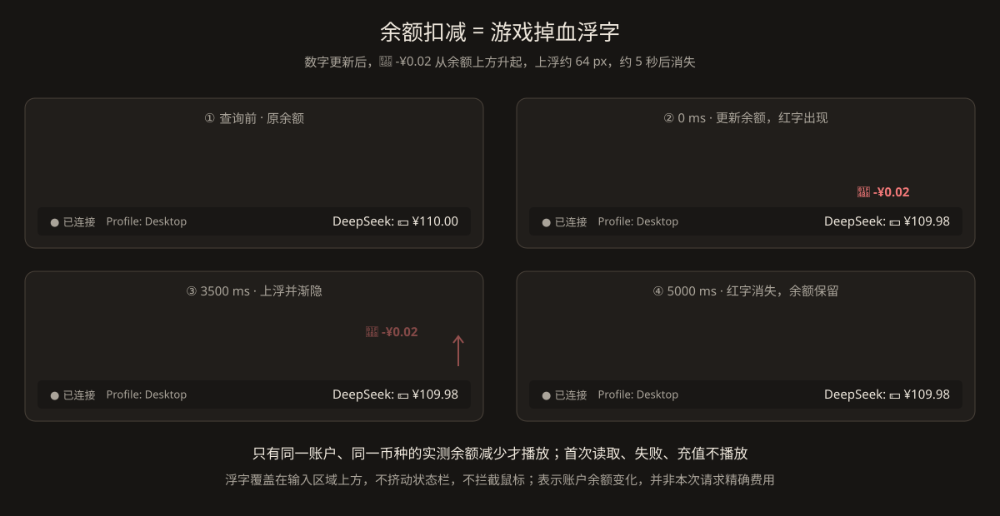

<h1 align="center">DeepSeek 余额显示方案</h1>

<p align="center">在底部 Profile 状态栏展示当前 DeepSeek 官方账户余额；余额减少时，以红色减额向上飘动并渐隐，类似游戏中的掉血提示。业务代码已落地，包含独立直连控制器、事件接入、精确差额与浮字组件，并通过离线后端及 QML 测试；真实账户与目标机器网络仍需人工验收。</p>

<h2 align="center">1. 已确认范围</h2>

<p align="center">仅在当前已确认模型的 provider 为 deepseek 时启用并显示。其他 provider、模型尚未确认或连接重建期间默认禁用，不发余额请求。不得仅凭模型名称包含 deepseek 判断；第三方中转或其他 provider 下的同名模型不属于首版范围。</p>

<p align="center">余额查询始终直连，不使用 AppSettings.proxyUrl、不继承环境代理或系统代理。此约束仅影响余额查询，不改变 Pi 模型调用的代理行为。</p>

<p align="center">只使用当前 Profile 的凭据，不读取其他 Profile，不回退 DEEPSEEK_API_KEY。凭据缺失、无法解析、请求失败或响应异常统一显示“DeepSeek: 余额获取失败”，悬浮提示提供脱敏原因。</p>

<p align="center">启用时查询一次，此后每 5 分钟刷新并保留手动刷新；模型响应结束不再触发查询；单次请求总超时 1 秒；首次尝试失败后最多重试 3 次，即一次刷新任务最多 4 次 HTTP 请求。余额功能不能阻塞、重试或中止聊天请求。</p>

<h2 align="center">2. 官方文档与接口依据</h2>

<p align="center"><a href="https://api-docs.deepseek.com/api/get-user-balance">官方：Get User Balance</a> · <a href="https://api-docs.deepseek.com/quick_start/rate_limit">官方：Rate Limit &amp; Isolation</a> · <a href="https://api-docs.deepseek.com/quick_start/error_codes">官方：Error Codes</a></p>

```http
GET https://api.deepseek.com/user/balance
Authorization: Bearer <当前 Profile 的 DeepSeek API Key>
Accept: application/json
```

```json
{
  "is_available": true,
  "balance_infos": [
    {
      "currency": "CNY",
      "total_balance": "110.00",
      "granted_balance": "10.00",
      "topped_up_balance": "100.00"
    }
  ]
}
```

<p align="center">官方定义：is_available 表示余额是否足够调用 API；balance_infos 是数组，currency 当前枚举为 CNY、USD；三个余额字段均为字符串。total_balance 是可用赠送余额与充值余额的合计，主栏展示此值。多币种分别展示、分别计算差额，不相加、不换汇。</p>

<p align="center"><strong>限流结论：</strong>本次查阅的余额接口文档没有给出 /user/balance 专属 QPS、RPM 或最低刷新间隔；通用限流页面描述的是模型请求的账户级并发限制，不能据此宣称余额接口不限流。通用错误文档说明 429 表示请求过快，500、503 可等待后重试。没有公开余额专属限额，不等于保证每次查询都成功。</p>

<p align="center">采用“每 5 分钟轮询 + 单并发 + 突发合并 + 429 冷却”，启用时首次查询，允许手动刷新。官方也未在上述页面承诺余额扣款实时可见或查询在 1 秒内完成；1 秒是本项目的用户约束，冷启动 DNS/TLS 等可能使失败率增加。</p>

<h2 align="center">3. 架构与凭据边界</h2>

```text
AppController
  ├── AgentSessionController：当前 provider、实时模型响应完成通知
  ├── AppSettings：当前 Profile 路径（不提供余额代理设置）
  └── DeepSeekBalanceController
       ├── 当前 Profile 的 DeepSeek 凭据解析
       ├── 专用 QNetworkAccessManager，显式 NoProxy
       ├── 超时、有限重试、请求代次、余额校验及精确差额
       └── 格式化文本、状态枚举、扣减动画信号

Main.qml footer
  ├── 余额文字、刷新操作、悬浮提示
  └── 窗口内浮字覆盖层：向上移动 + 渐隐，不参与布局
```

<p align="center">余额查询不是模型调用，但仍是 Qt 直连 DeepSeek，属于“Qt 仅通过 Pi 调用模型”原则的有意例外，应在项目技术方案中补充说明。现有 RPC 没有余额查询命令，本方案选择桌面端直接查询，并非声称扩展或桥接方案不可行。</p>

<p align="center">凭据来源限定为 &lt;当前 Profile&gt;/auth.json 中的 deepseek 项，标准结构如下。实现前应核实当前 Pi 版本实际支持的凭据表达方式；首版只支持已确认的直接 api_key 字符串，不自行执行命令型凭据，不把未知表达式当密钥发送，不静默改用其他来源。若 Pi 实际使用了不同的运行时密钥覆盖，本功能不能声称两者一定是同一账户。</p>

```json
{
  "deepseek": {
    "type": "api_key",
    "key": "<当前 Profile 的密钥>"
  }
}
```

<p align="center">每个新刷新任务重新读取凭据，以识别同一路径内密钥被替换。密钥仅在 C++ 内短暂持有，不暴露给 QML、不写入日志、配置或磁盘缓存。内部身份指纹仅用于比较，不输出。错误提示不包含认证头、原始响应正文或密钥。</p>

<h2 align="center">4. 触发时机与生命周期</h2>

<p align="center"><strong>首次启用：</strong>模型状态确认 provider=deepseek 后查询一次，建立余额基线；首次成功不播放扣减动画。模型切换或 Profile 切换后重新确认上下文，再建立新基线。</p>

<p align="center"><strong>周期查询：</strong>启用期间每 300000 ms 触发一次刷新；禁用、断线或切换 Profile 时取消旧周期，重新启用后重新计时。模型响应和压缩完成事件仅记诊断日志，不查询余额；手动刷新不重置周期。</p>

<p align="center"><strong>差额含义：</strong>周期查询观察账户累计余额变化，不与单次模型请求一一对应；未观测到减少时不播放动画，也不推算扣费。</p>

<p align="center"><strong>合并规则：</strong>同一账户最多一个在途请求或重试任务。期间收到的刷新事件设置一个 pending 标记，当前任务结束后最多补查一次；连续事件合并，避免形成无限队列。自动触发采用短暂合并窗口（建议 200 ms），手动刷新设置最小间隔 1 秒，并与自动刷新共用限流及重试状态。触发事件不是无限重置重试次数的理由。</p>

<p align="center"><strong>账户隔离：</strong>Profile、密钥身份或启用状态变化时，递增请求代次、取消 reply 和重试定时器、清空 pending、旧余额及浮字。响应仅在代次与账户身份仍匹配时生效。取消回调不可把新账户置为失败。切到非 DeepSeek 后隐藏组件并停止一切余额网络活动。</p>

<p align="center">现有 applySettings() 顺序更新多项设置，应在更新完成后统一应用余额上下文，避免在半更新状态发请求。代理变更不作为余额查询触发源。重新连接时先禁用，待 RPC 确认模型后恢复，防止沿用旧模型判断。</p>

<h2 align="center">5. 网络、超时和重试</h2>

<p align="center">使用余额专属 QNetworkAccessManager 并显式设置 QNetworkProxy::NoProxy；不得修改全局代理。固定官方 HTTPS URL，拒绝所有重定向，不忽略 TLS 验证错误。响应体设合理上限（建议 64 KiB），超限立即终止。所有路径均清理 reply、超时计时器和在途标记。</p>

<p align="center"><strong>1 秒超时：</strong>从发起 get() 到响应体接收完成采用独立单次 QTimer 的 1000 ms 总截止时间，包括连接、TLS 和下载；超时 abort()。不能仅依赖“无数据活动超时”实现总时限。每次重试各有 1 秒时限；退避等待不计入单次请求，因此整个刷新任务可超过 1 秒。</p>

<p align="center"><strong>最多重试 3 次：</strong>网络暂时错误、超时、HTTP 500/503 等暂时服务端故障，分别等待 1 秒、2 秒、4 秒后重试。401、其他确定性 4xx、凭据错误、TLS 证书错误、重定向以及响应结构错误直接失败，不消耗无意义的额外请求。通用错误文档列出的错误码不是余额接口全部返回码的保证，必须对未知状态安全降级。</p>

<p align="center"><strong>429：</strong>仍计入同一任务的 3 次重试预算。有有效 Retry-After 时遵守秒数或 HTTP 日期；没有时采用保守冷却（建议 30 秒）。官方页面没有保证返回该头部，因此解析是兼容性策略。冷却期间手动与自动事件均不得绕过等待，最多保留一个待刷新标记；任务终结后仍保留尚未到期的冷却时间。</p>

<p align="center">失败时主栏统一显示“余额获取失败”；重试中可在悬浮提示显示“正在重试 1/3”。同一账户上次成功余额可仅保留在内存并在提示中标注“上次成功值 / 时间”，不能以正常余额样式冒充最新结果。新任务不能使用旧任务的计时器或响应更新状态。</p>

<h2 align="center">6. 响应解析与金额差额</h2>

<p align="center">严格校验 is_available 为布尔值、balance_infos 为非空数组、每项币种有效、金额字段为合法十进制字符串。缺字段、错误类型、重复币种、超长金额或无法解析的数据按获取失败处理，不能转为零余额。赠送和充值余额用于明细展示，不自行重算替代 total_balance。未知但格式合法的币种保留代码，不错误套用人民币符号。</p>

<p align="center"><strong>金额必须使用精确十进制：</strong>字符串展示可以保留原有小数精度，但掉血动画需要计算差额，应采用有长度与精度上限的十进制定点或字符串运算；禁止用 float/double 直接相减。官方未承诺固定两位小数，不应只按“分”存储或强制两位显示，避免小额消费被舍入成零。</p>

<p align="center">同一身份、同一币种相邻两次有效余额：若 new &lt; old，则产生 delta=old-new 的扣减事件；相等不播放，增加视为充值或调整，不播放红色扣减。首次取得、切换身份、币种新增或缺失后重新出现均只建立基线。失败不制造扣减事件；失败恢复后的差额是两次有效观测间的累计变化。</p>

<p align="center">此差额只能称为“账户余额减少”，不能称为“本次请求精确费用”：其他客户端消费、赠送余额到期以及扣款延迟都可能影响结果。官方未承诺即时结算；本次查询尚未反映扣款时不猜测扣费，也不为动画无限补查，后续刷新自然显示变化。</p>

<p align="center">is_available=false 且响应有效时仍是查询成功，显示余额并提示“余额不足 / 账户不可用”，采用警告配色；尚未取得有效响应时，不把布尔默认值 false 解释为余额不足。</p>

<h2 align="center">7. 游戏掉血式动画设计</h2>

<p align="center"></p>

<p align="center">展示格式：人民币余额使用“💵 ¥110.00”，不展示 CNY 字样；人民币扣减浮字使用“💸 -¥0.02”。接口数据和内部币种标识仍保留 CNY，其他币种不得误标为人民币。emoji 保留自身呈现颜色，扣减金额文字使用红色粗体，字号与余额文字保持一致（分镜中均为 15 px，实际组件绑定余额文字字号），并在发布环境验证 emoji 字体回退。</p>

<p align="center">示例：余额从 💵 ¥110.00 更新为 💵 ¥109.98，余额数字立即更新；其上方出现“💸 -¥0.02”，向上移动约 64 px，并在约 5000 ms 后消失。余额 Label 自身不移动，状态栏高度保持不变。</p>

<p align="center">动画时间线：0–5000 ms 持续上浮，前 2000 ms 保持不透明，后 3000 ms 逐步淡出。整个动画保持与余额文字相同的字号，不增加缩放效果。采用主题适配的红色，深浅主题均可辨识。初版不增加音效、屏幕震动或充值动画。</p>

<p align="center">浮字应放到窗口内容的非交互覆盖层，映射余额 Label 的坐标定位；不得作为 footer RowLayout 的子项参与排版，也不能被 28 px 高状态栏裁剪。覆盖层不接受鼠标和键盘输入、不遮挡弹窗交互。并发扣减采用有界队列或同币种合并，建议最多保留 3 条，防止密集模型调用导致浮字堆叠。</p>

<p align="center">多币种分别标注币种播放，不合算；窗口过窄时余额可省略、明细放入悬浮提示。切换账户、禁用功能或组件销毁时立即停止并清除动画。提供稳定、可单测的动画完成清理路径。</p>

<h2 align="center">8. 对外接口与文件改动</h2>

<p align="center"><strong>新增 src/config/DeepSeekBalanceController.h/.cpp：</strong>负责凭据解析、请求状态机、精确金额差额和动画通知；可进一步提取纯解析函数便于测试。不新增 AppSettings.deepSeekKeyPath()，直接注入当前 Profile 路径即可。</p>

<p align="center">只读属性均提供 NOTIFY：enabled（当前是否符合启用条件）；state（Q_ENUM：Disabled / Loading / Ready / Error）；displayText（主栏格式化文字）；statusText（脱敏原因、重试进度或上次更新时间）；isAvailable（仅 Ready 时表示有效的账户可用状态）。所有属性、枚举值、函数和成员均按项目要求补充中文注释。</p>

<p align="center">提供 refresh() 手动刷新入口、统一上下文更新入口，以及 balanceDecreased(currency, amountText) 信号。currency 表示币种，amountText 表示精确正差额字符串；QML 只收到展示所需的非敏感信息，不接触原始密钥、原始响应或参与金额运算。</p>

<p align="center"><strong>AgentSessionController：</strong>提供结构化当前 provider 与实时 assistant 响应完成通知，不能让 QML 解析 modelName 拼接字符串。通知携带必要的请求上下文用于防止跨 Profile、跨模型归属错误。</p>

<p align="center"><strong>AppController：</strong>持有控制器，统一协调已应用的 Profile、模型确认与生命周期。构造支持测试注入，避免测试自动读取真实凭据或发请求。</p>

<p align="center"><strong>CMakeLists.txt：</strong>引入 Qt6::Network，应用与实际使用控制器的测试目标同步加入源文件和链接依赖。验证 Windows 发布目录 TLS 后端插件能被 Qt 部署脚本正确包含。</p>

<p align="center"><strong>QML：</strong>在 Main.qml footer 增加独立 DeepSeekBalance 组件，并增加动画覆盖层。状态采用已注册枚举比较；悬浮使用 HoverHandler 或启用 hoverEnabled 的 MouseArea，不直接引用 Label 不存在的 hovered。建议使用支持键盘和可访问名称的刷新控件，而非仅实现鼠标点击。</p>

<h2 align="center">9. 测试与验收</h2>

<p align="center"><strong>凭据与安全：</strong>临时 Profile 覆盖有效 key、缺失、损坏、错误类型和原路径 key 更换；证明不会回退环境变量或其他 Profile。请求层断言 NoProxy、固定 URL、认证头及拒绝重定向，日志与 QML 不出现密钥。</p>

<p align="center"><strong>解析与动画差额：</strong>覆盖官方样例、多币种、小数精度、极小扣减、相等、充值、首次成功、缺字段、空数组、重复币种、异常长度、失败恢复和 is_available=false。验证不会出现浮点伪差额或把错误当零余额。</p>

<p align="center"><strong>状态机：</strong>使用可注入网络层和时钟验证 1000 ms 总截止、最多首次加 3 次尝试、退避、429 冷却、401 不重试、取消 reply、pending 合并及过期响应隔离。禁止真实外网；全部 AppController 相关测试默认使用桩或禁用自动请求。</p>

<p align="center"><strong>事件接入：</strong>一个 prompt 经历多次 assistant 响应分别触发；token、工具输出、历史加载不触发；切换非 DeepSeek 后不发请求；重连待确认期间隐藏；内部自动重试和压缩事件覆盖范围按实际 RPC 桩记录验收，不虚报“一次底层请求一次查询”。</p>

<p align="center"><strong>QML 与发布：</strong>验证红字向上、渐隐、完成清理、不移动状态栏、不拦截点击、不被裁剪；验证 💵 / 💸 图标及 ¥ 符号正常显示、队列上限、窄窗口、深浅主题、Profile 切换清除浮字。人工使用配置好的当前 Profile 验证直连与发布包 TLS，失败只影响余额显示，不影响聊天。</p>

<h2 align="center">10. 首版参数汇总</h2>

<p align="center">启用条件：已确认 provider=deepseek；网络：强制直连；凭据：仅当前 Profile；固定轮询：每 5 分钟；刷新：启用时一次、周期到期、手动点击；合并窗口：建议 200 ms；手动最小间隔：建议 1 秒；单次总超时：1000 ms；最多重试：3 次（总尝试最多 4 次）；普通退避：1 / 2 / 4 秒；429 无 Retry-After 时冷却：建议 30 秒；浮字：约 5000 ms、上浮 64 px、最多 3 条。</p>

<p align="center">实现位置：src/config/DeepSeekBalanceController.{h,cpp}、qml/components/DeepSeekBalance.qml，以及 AgentSessionController / AppController 的事件接入。已同步 README 与项目技术方案中的架构例外；构建及 CTest 全部 8 个测试目标通过，测试不访问真实外网。本次不提交或推送代码和文档。</p>
